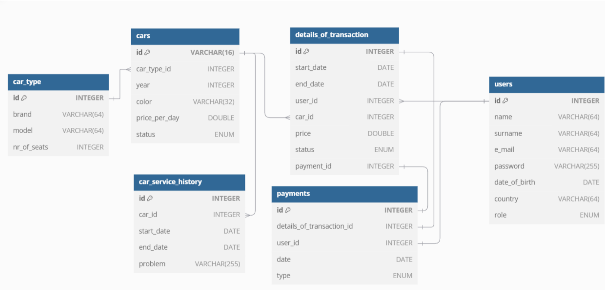
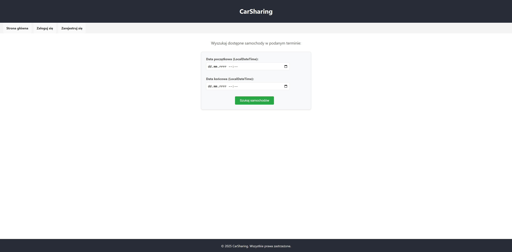

# Car Sharing System

Projekt przedstawiający system wypożyczalni samochodów z podziałem na backend i frontend.  
Aplikacja umożliwia przeglądanie dostępnych samochodów oraz zarządzanie wypożyczeniami.

## Diagram bazy danych

  

## Przykładowe widoki aplikacji

  
  

  
  

  
  

---

## Repozytoria

### Backend
Backend aplikacji odpowiedzialny za logikę biznesową, API oraz komunikację z bazą danych.

[car_sharing_back](https://github.com/kubikal7/car_sharing_back)

### Frontend
Interfejs użytkownika umożliwiający korzystanie z systemu wypożyczalni samochodów.

[car_sharing_front](https://github.com/kubikal7/car_sharing_front)

### Logowanie do systemu

Można zalogować się na konto administratora:

- **Login:** `admin@admin.pl`  
- **Hasło:** `admin`

## Technologie

- React
- Java Spring Boot
- MySQL
